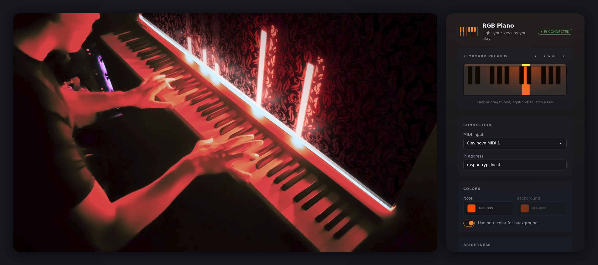

# RGBPiano

Light up a WS2812 LED strip behind your piano as you play. MIDI from your
computer is mapped to LED frames on the host, then streamed over WiFi to a
Raspberry Pi Zero that drives the strip. A local Svelte UI covers colors,
brightness, key mapping, and note envelopes.

Inspired by [onlaj/Piano-LED-Visualizer](https://github.com/onlaj/Piano-LED-Visualizer).

<p align="center">
  
</p>

## Features

- **MIDI in** — pick any input port (piano or a virtual DAW port); the host
  rebinds across hotplug and devices that sleep
- **Note mapping** — 88-key range onto a configurable LED start/end, invert,
  LEDs per key, and adjacent-key taper
- **Color and velocity** — note color vs background glow, optional shared
  color, velocity blend or constant intensity
- **Envelopes** — attack, release, and release-hold, animated at 120 FPS on
  the strip and the on-screen preview
- **Keyboard preview** — click or drag to test; right-click latches a key;
  preview MIDI is sent to the real strip
- **Pi sink** — a tiny Python server blits finished frames; systemd install;
  stale frames are dropped so the strip never lags
- **Persist** — settings saved to `~/.rgbpiano/config.json`

## Stack

TypeScript · Node · Svelte 5 · Vite · Tailwind CSS · DaisyUI · JZZ · WebSocket
· Python · rpi_ws281x · systemd · Raspberry Pi Zero · WS2812

## How it is put together

```
  Piano ──USB/MIDI──▶  Host computer  ──WiFi (WebSocket)──▶  Raspberry Pi Zero  ──▶  WS2812 strip
                       (Node + TypeScript)                    (tiny Python driver)
                       • reads MIDI
                       • computes LED frames
                       • serves config web UI
                       • streams pixels to the Pi
```

Two pieces:

**`host/`** is the brains. It runs on your computer (Linux / macOS / Windows):
MIDI in, note → LED mapping, color and envelope math, the config UI on
`http://localhost:3192`, and a binary frame stream to the Pi.

**`pi/`** is a deliberately dumb display sink. It receives a finished pixel
frame and blits it to the strip via [`rpi_ws281x`](https://github.com/jgarff/rpi_ws281x).
No MIDI logic, no color math. That keeps the Pi side ~100 lines and uses the
Python that ships with Raspberry Pi OS.

Moving all visual logic to the host means one typed source of truth (testable
without the strip), a trivial Pi script, and no duplicated mapping across two
runtimes. Chords are coalesced into a single frame; the Pi keeps only the
newest frame if rendering falls behind.

## Getting started

### Host (your computer)

Requires Node 20+.

```bash
cd host
npm install
npm start          # builds the web UI, then runs the host
```

Then open http://localhost:3192, pick your MIDI input, set the Pi address, and
play. Config is saved to `~/.rgbpiano/config.json`.

For development with hot-reloading UI on the same port:

```bash
cd host
npm run dev        # host + UI on http://localhost:3192
```

### Pi (the LED driver)

Clone this repo on the Pi, then:

```bash
cd RGBPiano/pi
./install.sh       # idempotent: installs deps + a systemd service, starts on boot
```

To update after pulling new code, run `./install.sh` again. To remove
everything (service + virtualenv):

```bash
./uninstall.sh
```

Useful checks on the Pi:

```bash
systemctl status rgbpiano       # is it running?
journalctl -u rgbpiano -f        # live logs
```

The LED data pin defaults to GPIO 18 and the port to 3193. Override with the
`RGBPIANO_GPIO` / `RGBPIANO_PORT` environment variables in the service if needed.

## Ports

| Port | Where | What |
| ---- | ----- | ---- |
| 3192 | Host  | Config web UI + browser WebSocket |
| 3193 | Pi    | LED frame stream (host → Pi) |

## Hardware

- Raspberry Pi Zero (W / 2 W) + microSD
- WS2812 addressable RGB LED strip (better strip = better color)
- 5V power supply sized for your LED count
- Digital piano or MIDI controller with a USB/MIDI output
- See [onlaj/Piano-LED-Visualizer](https://github.com/onlaj/Piano-LED-Visualizer) for
  detailed wiring
